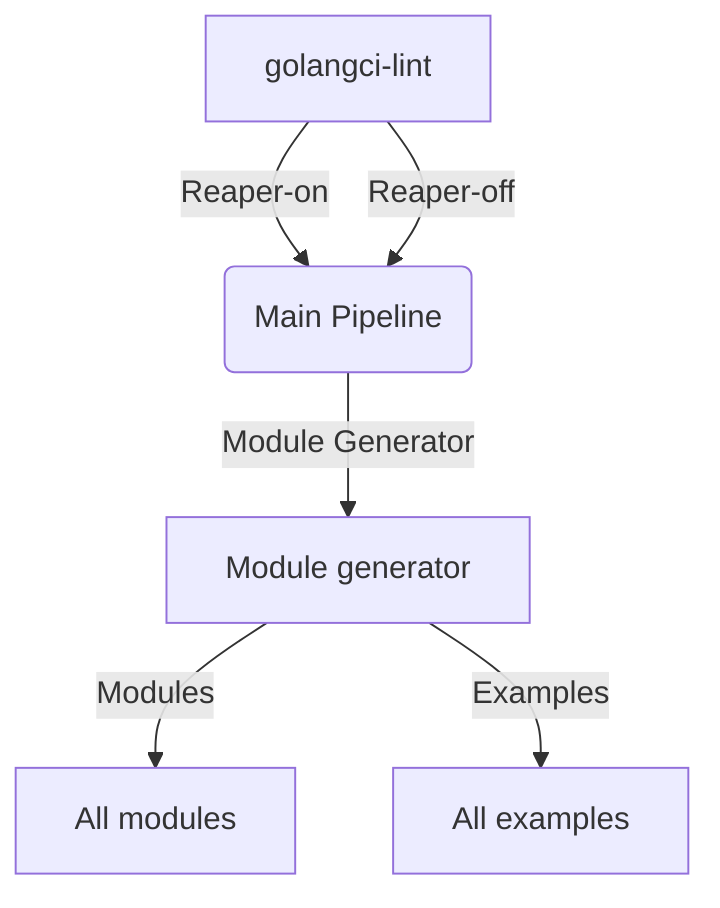

# Github Workflows

The execution order of the workflows is as follows:

1. [Linting](golangci-lint.yml)
2. Main pipeline, will run in parallel:
    - [Regular pipeline](ci.yml)
    - [Reaper Off pipeline](ci-reaper-off.yml)
3. [Modules generator pipeline](ci-modulegen.yml)
4. Modules pipeline, will run in parallel:
    - All modules' pipelines
    - All examples' pipelines

_MermaidJS diagram created with https://mermaid.live._

